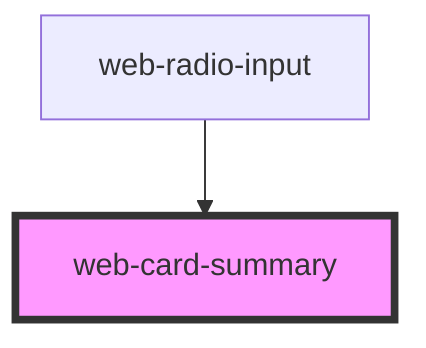

# web-card-summary

<!-- Auto Generated Below -->

## Properties

| Property                   | Attribute | Description | Type      | Default     |
| -------------------------- | --------- | ----------- | --------- | ----------- |
| `cardSummary` _(required)_ | --        |             | `WebCard` | `undefined` |

## Dependencies

### Used by

 - [web-radio-input](../web-radio-input)

### Graph

----------------------------------------------

*Built with [StencilJS](https://stenciljs.com/)*
