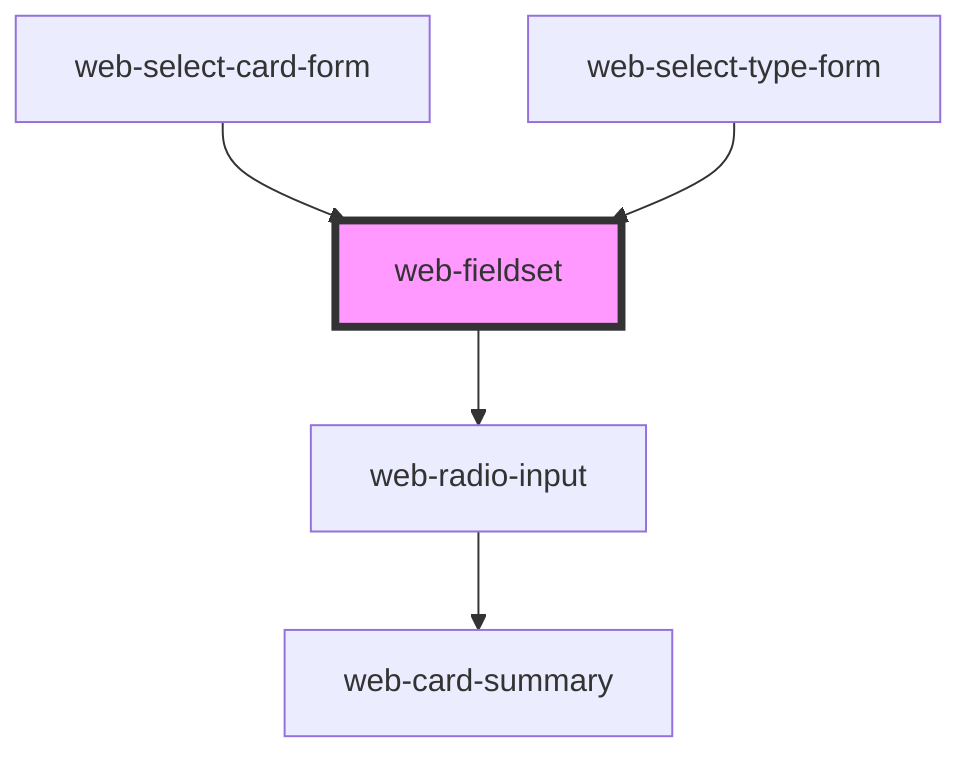

# web-fieldset

<!-- Auto Generated Below -->

## Properties

| Property                  | Attribute     | Description | Type                    | Default     |
| ------------------------- | ------------- | ----------- | ----------------------- | ----------- |
| `inputType` _(required)_  | `input-type`  |             | `"checkbox" \| "radio"` | `undefined` |
| `legendText` _(required)_ | `legend-text` |             | `string`                | `undefined` |
| `options` _(required)_    | --            |             | `RadioProps[]`          | `undefined` |
| `slotLabel` _(required)_  | `slot-label`  |             | `boolean`               | `undefined` |

## Dependencies

### Used by

 - [web-select-card-form](../web-select-card-form)
 - [web-select-type-form](../web-select-type-form)

### Depends on

- [web-radio-input](../web-radio-input)

### Graph

----------------------------------------------

*Built with [StencilJS](https://stenciljs.com/)*
