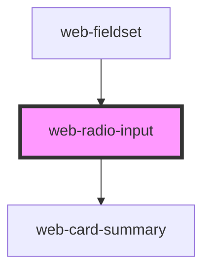

# web-radio-input

<!-- Auto Generated Below -->

## Properties

| Property                     | Attribute | Description | Type         | Default     |
| ---------------------------- | --------- | ----------- | ------------ | ----------- |
| `webRadioProps` _(required)_ | --        |             | `RadioProps` | `undefined` |

## Dependencies

### Used by

 - [web-fieldset](../web-fieldset)

### Depends on

- [web-card-summary](../web-card-summary)

### Graph

----------------------------------------------

*Built with [StencilJS](https://stenciljs.com/)*
